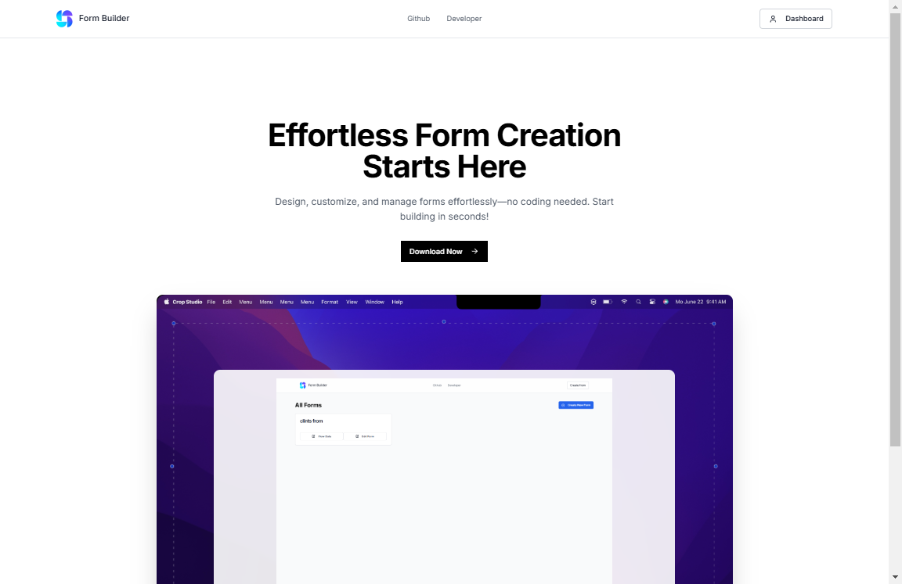
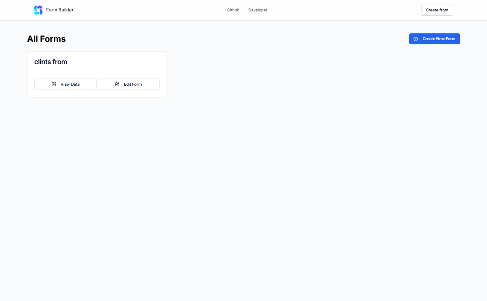
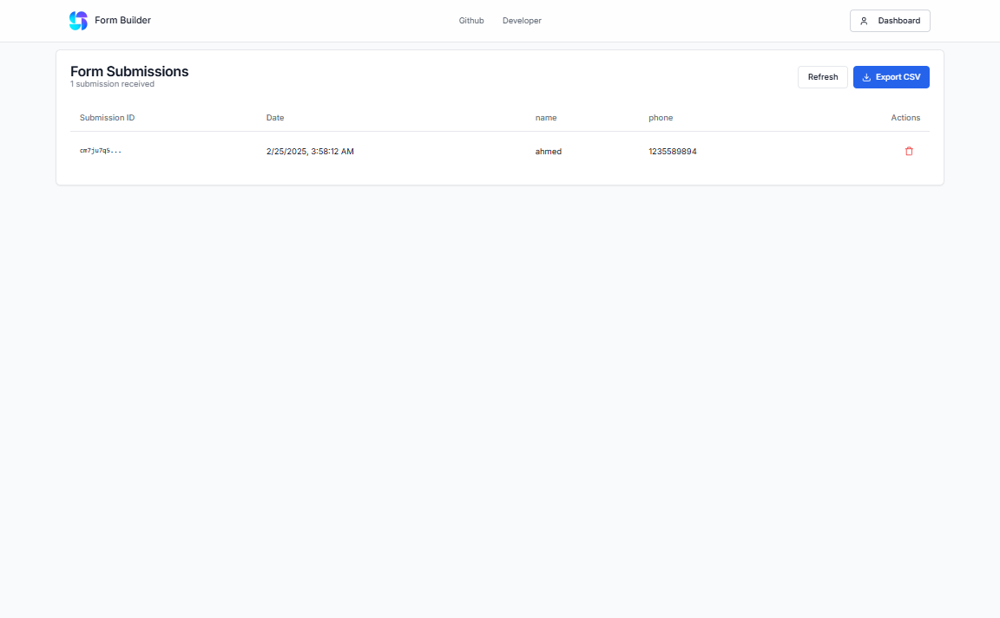
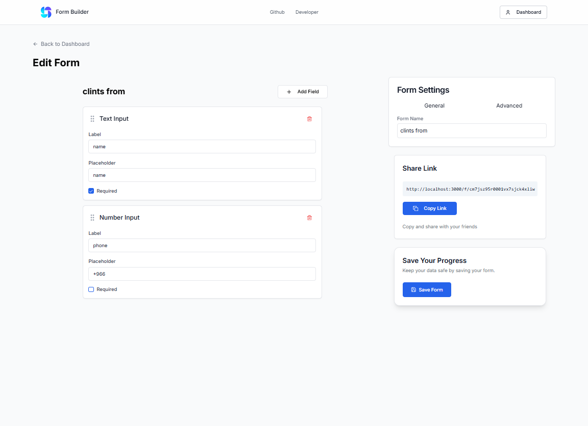
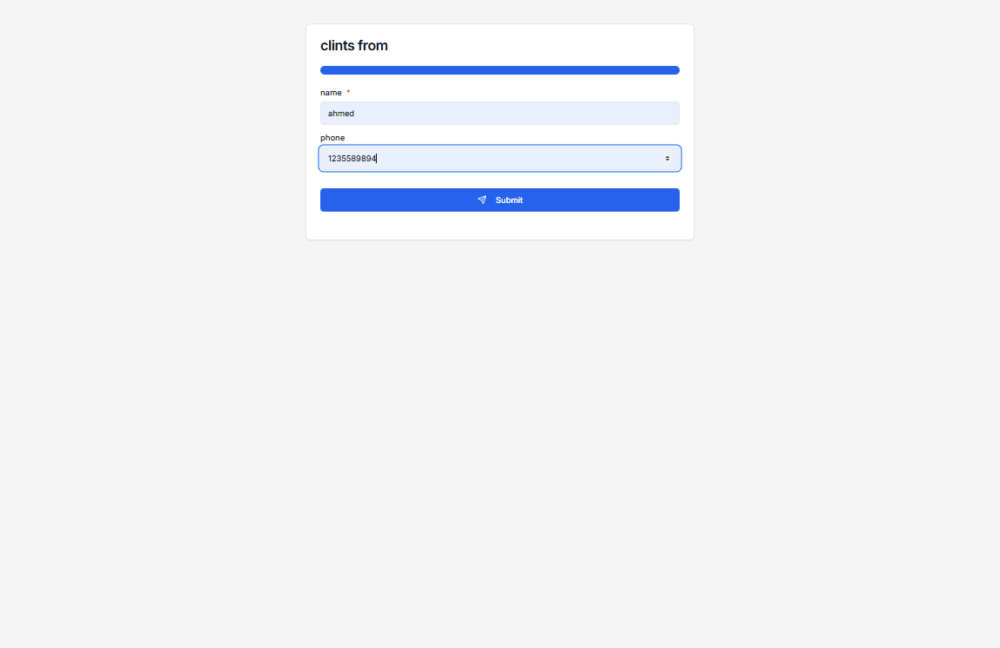

# 🌟 Form Builder - Create Forms Easily!

<p align="center">
  
</p>

## 🚀 Overview

**Form Builder** is a cutting-edge, intuitive tool designed to empower you to create and manage forms with unprecedented ease. Whether you're a newcomer to digital form creation or a seasoned designer, Form Builder offers an elegantly simple interface that eliminates the need for coding—allowing you to focus on crafting outstanding forms.

---

## 🎯 Key Features

- **Drag & Drop Builder**: Enjoy a seamless drag-and-drop experience for placing and rearranging form elements.
- **Customizable Fields**: Tailor every aspect of your form, from input types to labels and validation rules, ensuring a perfect fit for your needs.
- **Real-time Preview**: Instantly visualize your form as you build, making adjustments in real time.
- **Responsive Design**: Designed to look stunning on any device—mobile, tablet, or desktop.
- **Security & Performance**: Optimized for both speed and security, ensuring a smooth user experience without compromise.

---

## 📸 Visual Gallery

### 🔹 landing page
<p align="center">
  
</p>

 ### 🔹 Form Dashboard
<p align="center">
  
</p>

### 🔹 Form data visualization
<p align="center">
  
</p>


### 🔹 Form Builder Interface
<p align="center">
  
</p>

### 🔹 Preview & Submission
<p align="center">
  
</p>


---

## 🔧 Installation Instructions

To get started locally, follow these simple steps:

```bash
git clone https://github.com/your-repo/form-builder.git
cd form-builder
npm install
npm run dev


```

---

## 📝 License
This project is licensed under the MIT License - see the [LICENSE](LICENSE) file for details.

---

## 🙏 Acknowledgments
Form Builder is built with the help of the following open-source libraries:

- [React](https://reactjs.org/)
- [React Router](https://reactrouter.com/)
- [React Hook Form](https://react-hook-form.com/)
- [React Icons](https://react-icons.github.io/react-icons/)
- [React Draggable](https://github.com/react-grid-layout/react-draggable)
- [React Select](https://react-select.com/)
- [React Datepicker](https://github.com/Hacker0x01/react-datepicker)
- [React Date Range](https://github.com/Adphorus/react-date-range)
- [React Date Range Picker](https://github.com/Adphorus/react-date-range-picker)  
- [React Date Range Picker](https://github.com/Adphorus/react-date-range-picker)
- [React Date Range Picker](https://github.com/Adphorus/react-date-range-picker)  
- [React Date Range Picker](https://github.com/Adphorus/react-date-range-picker)    


